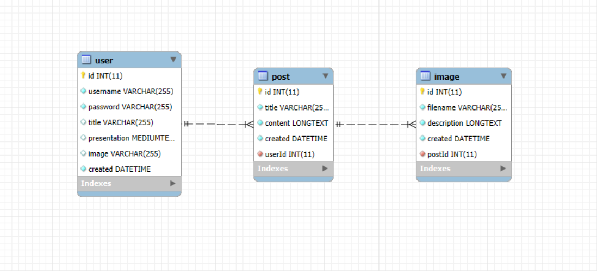

# PHP Blog App

A lightweight blog application built with PHP and MySQL. Users can read blog posts, and admins can create new posts via a basic form.

## Visual Overview

## Features

- List all blog posts
- View individual posts
- Create new posts (admin)
- Simple and clean design
- PDO-based database connection

## Database
The application uses a MySQL database hosted on **Azure Database for MySQL**.
- Import the schema from `sql/d0019e_blog.sql`.
- Configure your database credentials and server name in your environment or `db.php` file.
- Make sure to use SSL for secure connection.

The application uses a MySQL database hosted on **Azure Database for MySQL**.
## Setup

1. Import the SQL file:
sql/d0019e_blog.sql
2. Update `db.php` with your database credentials.
3. Place the project in your web server (e.g., XAMPP's `htdocs`).
4. Access it via:
http://localhost/bloggprojekt/index.php

## Deployment
Demo: https://blogg-app-899r.onrender.com/public/pages/index.php
